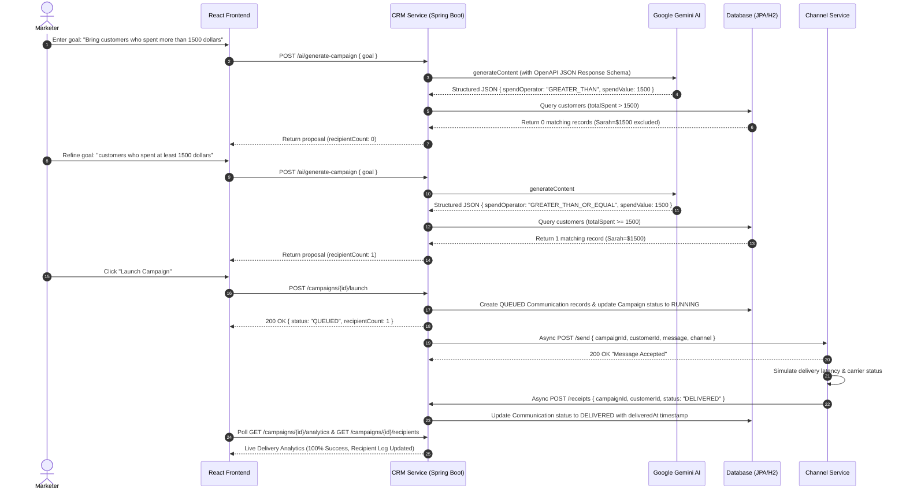

# XENO AI CRM

An AI-Native Mini CRM and Campaign Automation Platform built as part of the **Xeno Engineering Take-Home Assignment**.

XENO AI CRM empowers marketers to convert high-level marketing objectives into targeted campaigns using natural language AI strategies paired with deterministic, operator-level database segmentation and simulated multi-channel dispatches.

---

## 🌐 Live Demo & Deployed Services

| Component | Technology | Deployed URL |
| :--- | :--- | :--- |
| **Frontend Application** | React 19 + Vite | [https://xeno-ai-m3lxtufa4-kkks-projects-4cb723de.vercel.app/login](https://xeno-ai-m3lxtufa4-kkks-projects-4cb723de.vercel.app/login) |
| **CRM Backend Service** | Spring Boot + Java 21 | [https://xeno-crm-service.onrender.com](https://xeno-crm-service.onrender.com) |
| **Channel Dispatch Service** | Spring Boot + Java 21 | [https://xeno-channel-service-499m.onrender.com](https://xeno-channel-service-499m.onrender.com) |

> [!NOTE]
> Deployed microservices on Render's free tier may experience a brief spin-up latency on initial cold requests.

---

## 📌 Project Overview

Traditional CRM platforms require marketers to navigate complex query builders, manually construct database filters, write message templates from scratch, and map communication channels manually. 

**XENO AI CRM** redefines this workflow with an **AI-Native Architecture**:
1. Marketers express campaign goals in plain English (e.g., *"Bring customers who spent more than 1500 dollars"*).
2. Google Gemini AI interprets the strategic intent and outputs structured criteria schema.
3. The Spring Boot backend executes **deterministic SQL/JPA queries** enforcing strict operator semantics (`>`, `>=`, `<`, `<=`, `==`, `BETWEEN`).
4. Dispatches are dispatched asynchronously to an isolated **Channel Microservice**, which simulates carrier dispatches and returns real-time receipt callbacks.

---

## ✨ Core Features

### 1. Customer Management
- **Customer Profiles**: Store customer records containing `name`, `email`, `phone`, `totalSpent`, `lastOrderDate`, and `userId`.
- **Search & Filtering**: Real-time frontend search by customer name or email address.
- **Segment Sorting & Views**: Sort customer lists by total spend, recency, or alphabetical order.
- **Order Synchronization**: Customer spending metrics (`totalSpent`, `lastOrderDate`) automatically update whenever new orders are processed.

### 2. User Authentication & Security
- **Registration & Login**: Secure user onboarding with BCrypt password hashing.
- **JWT Authorization**: Stateless JSON Web Token authentication for all protected API endpoints.
- **Multi-Tenant Data Isolation**: All customer profiles, campaigns, and communications are strictly scoped to the authenticated user ID (`userId`).
- **Resilient Error Feedback**: Robust error responses distinguishing validation errors (400), duplicate username conflicts (409), unauthorized access (401), and network offline states.

### 3. AI Campaign Studio
- **Natural Language Strategy Generation**: Enter business goals without learning complex query syntax.
- **Structured Recommendation Proposals**: AI auto-generates:
  - Short Campaign Title
  - Target Segment Classification
  - Operator-Aware Audience Criteria JSON
  - Estimated Audience Recipient Count
  - Recommended Communication Channel (`EMAIL`, `WHATSAPP`, `SMS`, `PUSH`)
  - Personalized Copy Message (under 40 words)
- **Interactive Proposal Tuning**: Review, customize copy message, campaign title, and dispatch channel prior to saving or launching.

### 4. Deterministic Audience Segmentation
> [!IMPORTANT]
> **Architectural Principle**: AI performs natural-language intent recognition, but **the backend strictly owns database evaluation**. AI outputs structured criteria with explicit comparison operators (`spendOperator`), preventing probabilistic LLMs from introducing threshold ambiguities.

Supported spending operators evaluated deterministically:

| Natural Language Phrase | Criteria `spendOperator` | Executed Backend Comparison |
| :--- | :--- | :--- |
| *"more than $1500"*, *"above $1500"* | `GREATER_THAN` | `totalSpent > 1500` |
| *"at least $1500"*, *"minimum $1500"* | `GREATER_THAN_OR_EQUAL` | `totalSpent >= 1500` |
| *"less than $1500"*, *"below $1500"* | `LESS_THAN` | `totalSpent < 1500` |
| *"at most $1000"*, *"maximum $1000"* | `LESS_THAN_OR_EQUAL` | `totalSpent <= 1000` |
| *"spent exactly $1000"*, *"equal to $1000"* | `EQUAL` | `totalSpent == 1000` |
| *"between $1000 and $1500"* | `BETWEEN` | `totalSpent >= 1000 AND totalSpent <= 1500` |

*This explicit operator architecture guarantees that "more than $1500" excludes customers who spent exactly $1500.*

### 5. Campaign Lifecycle & Dispatch Idempotency
- **Draft Management**: Save AI-generated proposals as `DRAFT` campaigns for future review.
- **Idempotency Guard**: Prevents duplicate campaign dispatches by checking campaign status (`DRAFT` only) and existing communication logs before triggering background jobs.
- **Zero-Recipient Protection**: Prevents empty campaign dispatches. If 0 customers match criteria, launching is disabled in the UI and blocked on the backend (`400 Bad Request: No customers match this audience criteria.`).

### 6. Channel Service Microservice
- Isolated Spring Boot service simulating multi-channel carrier dispatches (`EMAIL`, `SMS`, `WHATSAPP`, `PUSH`).
- Asynchronous dispatch simulation with controlled latency.
- Carrier failure simulation (e.g., *Mailbox Full*, *Carrier Network Timeout*) with automated REST callback receipts sent to `POST /receipts` on the CRM Service.
- Concurrency-safe dispatch throttling (200ms rate pacing + exponential backoff retries for HTTP 429 status codes).

### 7. Real-Time Delivery Analytics
- **Live Performance Metrics**:
  - `Total Recipients`: Persisted customer target count.
  - `Delivered`: Carrier-confirmed successful dispatches.
  - `Failed`: Carrier failure notifications.
  - `Delivery Success Rate`: `(Delivered / Total) * 100`.
- **Distribution Ratio Chart**: SVG Donut visualization depicting delivery state ratios.
- **Customer Recipient Dispatch Log**: Audit log table showing recipient names, emails, delivery status (`QUEUED` → `SENT` → `DELIVERED` / `FAILED`), processed timestamps, and carrier error logs.
- *Metric Scope Note*: Analytics reflect physical carrier delivery receipts. Open-rate and click-through metrics are explicitly labeled as out of scope in the current UI.

---

## 🏗️ System Architecture

```
                                    +-----------------------+
                                    |   Google Gemini API   |
                                    | (gemini-3.6-flash)    |
                                    +-----------^-----------+
                                                |
                                      JSON Schema Response
                                                |
+--------------------------+  REST API  +-------v---------------+
|                          | ---------> |                       |
|   React + Vite Frontend  |            |   Spring Boot CRM     |
|   (Deployed on Vercel)   | <--------- |   Service             |
|                          |  JWT Auth  | (Deployed on Render)  |
+--------------------------+            +-------+---------------+
                                                |
                                        REST Async Dispatch
                                                |
                                                v
                                        +---------------+       Simulated Carrier
                                        | Spring Boot   | ----> Delivery Loop
                                        | Channel       |
                                        | Service       | <---- Delivery Receipt
                                        +-------+-------+       Callback
                                                |
                                                v
                                        +---------------+
                                        | CRM Callback  |
                                        | POST /receipts|
                                        +---------------+
```

---

## 🔄 Complete Communication Flow



---

## 🤖 AI-Native Approach vs. Traditional CRM

| Dimension | Traditional CRM Platforms | XENO AI-Native CRM |
| :--- | :--- | :--- |
| **Audience Selection** | Manual multi-step SQL/UI filter configuration | Natural language goal translated directly into criteria |
| **Campaign Messaging** | Manual copywriting from blank templates | AI auto-generates channel-tailored marketing copy |
| **Execution Boundary** | User manually maps filters & copies | AI generates strategic proposal; deterministic backend executes DB evaluation |
| **Error Prevention** | Human error in query threshold logic | Strict schema enforcement (`GREATER_THAN` vs `GREATER_THAN_OR_EQUAL`) |

---

## 💡 Example Campaign Workflow

### Input Business Goal
> *"Bring customers who spent more than 1500 dollars."*

### AI Strategic Recommendation Output
```json
{
  "name": "VIP Premium Outreach",
  "segmentType": "CUSTOM_SPENDING_RANGE",
  "criteria": {
    "spendOperator": "GREATER_THAN",
    "spendValue": 1500
  },
  "channel": "EMAIL",
  "message": "Thank you for being a valued customer! Enjoy 25% off your next purchase."
}
```

### Deterministic Database Evaluation
- Customer **Alice** (`totalSpent` = `$1000.00`) → `1000.0 > 1500.0` → ❌ **Excluded**
- Customer **SarahJohnson** (`totalSpent` = `$1500.00`) → `1500.0 > 1500.0` → ❌ **Excluded**
- **Evaluated Recipient Count**: `0` (Zero-recipient notice displayed in UI; launch prevented).

### Revised Input Business Goal
> *"Bring customers who spent at least 1500 dollars."*

### AI Strategic Recommendation Output
```json
{
  "name": "VIP High Spender Reward",
  "segmentType": "HIGH_VALUE_CUSTOMERS",
  "criteria": {
    "spendOperator": "GREATER_THAN_OR_EQUAL",
    "spendValue": 1500
  },
  "channel": "EMAIL",
  "message": "Exclusive VIP reward inside!"
}
```

### Deterministic Database Evaluation
- Customer **Alice** (`totalSpent` = `$1000.00`) → `1000.0 >= 1500.0` → ❌ **Excluded**
- Customer **SarahJohnson** (`totalSpent` = `$1500.00`) → `1500.0 >= 1500.0` → ✅ **Selected**
- **Evaluated Recipient Count**: `1` (Ready to launch).

---

## 🛠️ Tech Stack

### Frontend
- **Framework**: React 19, React Router DOM v7
- **Build Tool**: Vite v8
- **HTTP Client**: Axios
- **Styling**: Modern Vanilla CSS (Glassmorphism, custom design system, responsive card grids)

### CRM Backend Service (`crm-service`)
- **Language & Runtime**: Java 21, Spring Boot 3.5
- **Persistence & ORM**: Spring Data JPA, Hibernate ORM
- **Database**: H2 In-Memory Database (JDBC)
- **Security**: Spring Security 6, JJWT (io.jsonwebtoken 0.11.5)
- **JSON Processing**: Google Gson 2.10.1

### Channel Service (`channel-service`)
- **Language & Runtime**: Java 21, Spring Boot 3.5
- **Async Execution**: `@EnableAsync`, Spring TaskExecutor

### AI Infrastructure
- **Model**: Google Gemini API (`gemini-3.6-flash`)
- **Schema Enforcement**: OpenAPI 3.0 subset `responseSchema` with constrained Enums

### Cloud Deployment
- **Frontend Hosting**: Vercel
- **Backend Hosting**: Render (Web Services)

---

## 📁 Project Structure

```
xeno-ai-crm/
├── xeno-crm-frontend/             # React + Vite Frontend Application
│   ├── public/
│   ├── src/
│   │   ├── components/            # Reusable UI components (Navbar)
│   │   ├── pages/                 # Application views (Dashboard, Customers, Studio, Details, Login, Register)
│   │   ├── services/              # API Client Services (api.js, authApi.js, campaignApi.js, etc.)
│   │   ├── App.jsx
│   │   └── main.jsx
│   ├── package.json
│   ├── vite.config.js
│   └── vercel.json
│
├── xeno-crm-backend/              # Spring Boot Backend Services
│   ├── crm-service/               # Main CRM Core Microservice
│   │   ├── src/main/java/com/kavin/xeno/crm/
│   │   │   ├── config/            # RestTemplate & Bean Configs
│   │   │   ├── controller/        # Auth, Customer, Campaign, Ai, Receipt Controllers
│   │   │   ├── entity/            # JPA Entities (Customer, Campaign, Communication, SpendOperator, User)
│   │   │   ├── repository/        # Spring Data JPA Repositories
│   │   │   ├── security/          # JWT Filters, SecurityConfig, UserDetailsService
│   │   │   ├── service/           # Business Logic (AiCampaignService, SegmentationService, CampaignDispatcher)
│   │   │   └── CrmServiceApplication.java
│   │   ├── src/test/java/         # Comprehensive Unit & Integration Test Suites
│   │   └── pom.xml
│   │
│   └── channel-service/           # Secondary Channel Simulation Microservice
│       ├── src/main/java/com/kavin/xeno/channel/
│       │   ├── controller/        # ChannelController (/send)
│       │   ├── service/           # ChannelDeliveryService (Delivery simulation & callback dispatches)
│       │   └── ChannelServiceApplication.java
│       ├── src/test/java/
│       └── pom.xml
│
├── .env.example                   # Environment configuration template
└── README.md                      # Complete Project Documentation
```

---

## 🔐 Security & Environment Configuration

All sensitive API credentials and service endpoint URIs are configured via environment variables and never committed to source control.

### Required Environment Variables

#### CRM Backend Service (`crm-service`)
```env
GEMINI_API_KEY=your_google_gemini_api_key_here
GEMINI_MODEL=gemini-3.6-flash
CHANNEL_SERVICE_URL=https://xeno-channel-service-499m.onrender.com
JWT_SECRET=your_512_bit_hmac_sha512_secret_key_here
```

#### Channel Service (`channel-service`)
```env
CRM_SERVICE_URL=https://xeno-crm-service.onrender.com
```

#### Frontend (`xeno-crm-frontend`)
```env
VITE_API_URL=https://xeno-crm-service.onrender.com
```

---

## ⚡ Local Setup & Development Instructions

### Prerequisites
- **Java**: JDK 21 or higher
- **Node.js**: Node v18+ and npm
- **Maven**: Included via `./mvnw` wrapper

### 1. Clone Repository
```bash
git clone https://github.com/Kavinbuck77/xeno-ai-crm.git
cd xeno-ai-crm
```

### 2. Run CRM Backend Service
```bash
cd xeno-crm-backend/crm-service
$env:GEMINI_API_KEY="your_api_key_here"   # PowerShell
./mvnw spring-boot:run
```
*CRM Backend runs at `http://localhost:8080`*

### 3. Run Channel Service
```bash
cd xeno-crm-backend/channel-service
./mvnw spring-boot:run
```
*Channel Service runs at `http://localhost:8081`*

### 4. Run Frontend Application
```bash
cd xeno-crm-frontend
npm install
npm run dev
```
*Frontend runs at `http://localhost:5173`*

### 5. Execute Test Suites
```bash
# CRM Service Tests (35 tests)
cd xeno-crm-backend/crm-service
./mvnw test

# Channel Service Tests (2 tests)
cd xeno-crm-backend/channel-service
./mvnw test
```

---

## 📊 Current Implementation Status

### ✅ Implemented & Deployed
- Customer Management & Order History tracking
- JWT Authentication & User Registration
- AI Campaign Strategy Generation via Gemini API
- OpenAPI `responseSchema` constrained JSON parsing
- Operator-Based Deterministic Customer Segmentation (`>`, `>=`, `<`, `<=`, `==`, `BETWEEN`)
- Campaign Draft Saving & Launch Workflows
- Zero-Recipient Launch Prevention
- Isolated Channel Service Microservice with Async Latency Simulation
- Carrier Receipt Callback Loop (`POST /receipts`)
- Optimistic Locking (`@Version`) & Concurrency-Safe Receipt Handling
- Exponential Backoff & Dispatch Throttling (429 Rate-Limit Safeguard)
- Real-Time Delivery Analytics & SVG Donut Chart Visualizations

### 🚀 Future Improvements
- **PostgreSQL Production Database**: Migration from in-memory H2 to managed PostgreSQL.
- **Message Queue Processing**: Integration of Apache Kafka or RabbitMQ for scalable async dispatches.
- **Redis Caching**: Caching frequently resolved segment customer lists.
- **Behavioral Customer Analytics**: Open-rate and click-through tracking pixel endpoints.
- **Campaign Scheduling**: Cron-based scheduled campaign launches.
- **Real Carrier Gateways**: Integration with SendGrid (Email) and Twilio (SMS/WhatsApp).
- **Distributed Tracing**: Spring Cloud Sleuth / Zipkin observability across microservices.
- **Role-Based Access Control (RBAC)**: Admin vs. Marketer role permissions.

---

## 👨‍💻 Author

**Kavin K K**  
B.Tech — Computer Science and Engineering  
SRM Institute of Science and Technology  
**Registration Number**: `RA2311003020070`  
**GitHub**: [https://github.com/Kavinbuck77](https://github.com/Kavinbuck77)
